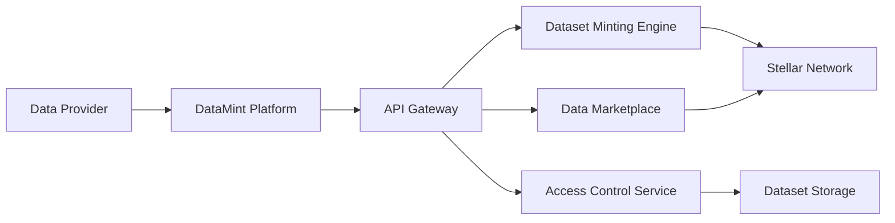
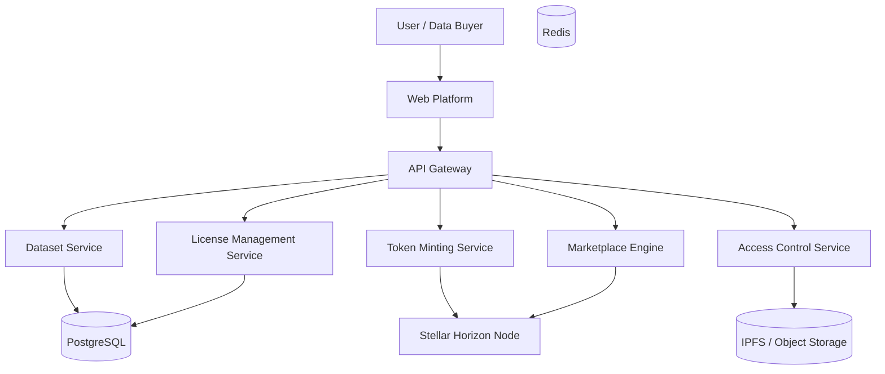
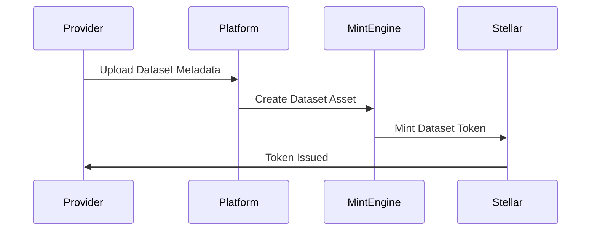
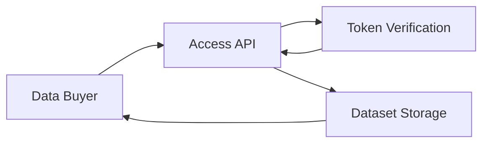
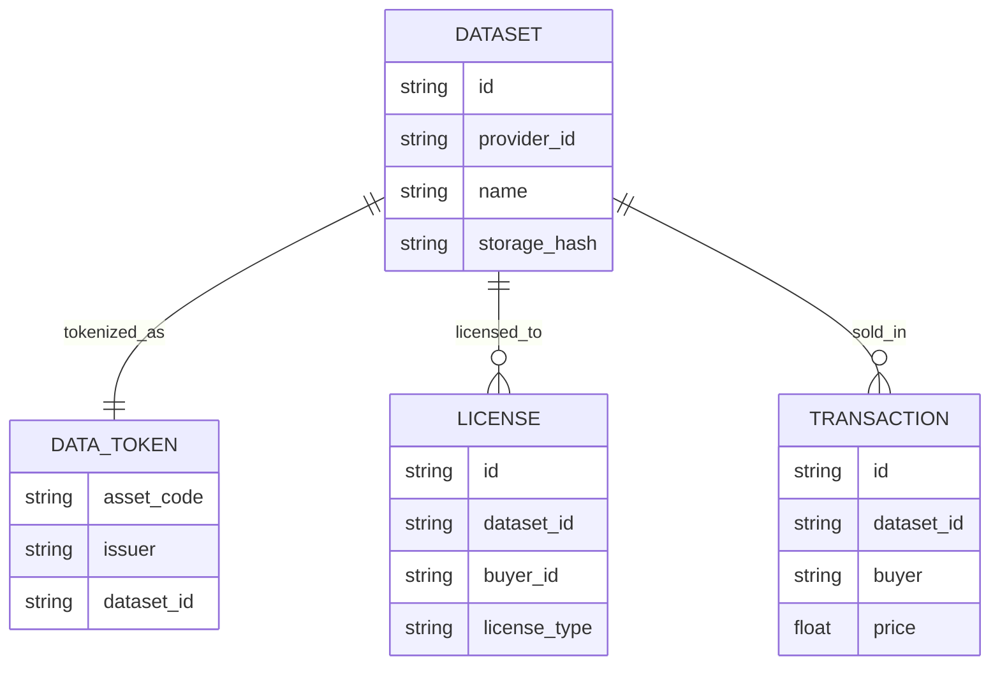

# DataMint

### Data Assets

DataMint is a decentralized **data asset tokenization protocol built on the Stellar network** that enables datasets to be minted, licensed, and traded as digital assets.

The protocol allows organizations, researchers, and data providers to convert datasets into **tokenized data assets**, enabling transparent ownership, monetization, and controlled access.

By leveraging Stellar's **native asset issuance and global payment infrastructure**, DataMint creates a programmable marketplace where data can be licensed and accessed globally.

---

## 1. Problem

Data is one of the most valuable digital resources today.

Examples of high-value datasets include:

- satellite imagery
- climate data
- scientific research datasets
- IoT sensor data
- mobility and traffic analytics
- AI training datasets

However, data markets face major challenges.

### Current Limitations

| Problem | Impact |
|--------|--------|
| Fragmented marketplaces | difficult discovery |
| Poor monetization models | data providers underpaid |
| Complex licensing | difficult for buyers |
| Ownership disputes | unclear data provenance |
| Limited interoperability | data locked in silos |

As a result, **data providers struggle to monetize their datasets**, and buyers face high friction when acquiring data.

---

## 2. Solution

DataMint provides a **protocol for tokenizing datasets as digital assets** on the Stellar network.

Each dataset is minted as a **data asset token** representing access rights to the dataset.

### Core Principles

- tokenized dataset ownership
- programmable data licensing
- global payment settlement
- transparent access control

### Example Dataset Token

**Dataset:** Global Weather Data

**Token:** DATA-WEATHER-001

Token holders can:

- purchase dataset access
- subscribe to data streams
- license data for commercial use

---

## 3. Key Features

### Dataset Tokenization

Data providers can mint datasets as Stellar assets.

### Programmable Licensing

Smart contracts enforce data licensing terms and access rights.

### Global Data Marketplace

Buyers can discover and purchase datasets globally.

### Access Control

Token ownership determines who can access dataset endpoints.

### Usage Tracking

All dataset transactions are transparently recorded.

---

## 4. Why Stellar

DataMint leverages the core capabilities of the Stellar network.

| Feature | Benefit |
|---------|---------|
| Native asset issuance | datasets become tokenized assets |
| Low transaction fees | cost-effective data trading |
| Fast settlement | instant global payments |
| Global infrastructure | accessible to international users |

Stellar provides the ideal infrastructure for **digital asset issuance and payments**.

---

## 5. System Architecture

---

## 6. Component Architecture

---

## 7. Dataset Minting Flow

The dataset itself is stored off-chain while ownership is tracked on-chain.

---

## 8. Data Access Flow

Access is granted only if the user owns the required dataset token or license.

---

## 9. Data Model

---

## 10. Token Model

Each dataset is represented by a Stellar asset.

| Field | Value |
|-------|-------|
| Dataset | Global Weather Data |
| Token | DATA-WEATHER-001 |
| Issuer | DataMint Protocol |
| Access Type | Subscription |
| Price | $50 / month |

---

## 11. Tech Stack

| Layer | Technologies |
|-------|--------------|
| **Frontend** | Next.js, React, TailwindCSS, Stellar wallet integration |
| **Backend** | Golang, Node.js, REST APIs, gRPC microservices |
| **Blockchain** | Stellar Network, Horizon API, Stellar SDK |
| **Infrastructure** | Docker, Kubernetes, PostgreSQL, Redis, AWS / GCP |
| **Data Storage** | IPFS, Cloud object storage, distributed data indexing |

---

## 12. Security Considerations

DataMint incorporates multiple security mechanisms.

| Layer | Protection |
|-------|------------|
| Token ownership verification | controls data access |
| Encrypted dataset storage | protects sensitive data |
| Access logs | tracks data usage |
| Signature verification | ensures dataset authenticity |
| Audit logs | transparent transaction history |

---

## 13. Revenue Model

DataMint generates revenue through data marketplace infrastructure.

| Revenue Stream | Fee |
|----------------|-----|
| Dataset minting | one-time issuance fee |
| Marketplace transactions | 1–2% |
| Enterprise data licensing | subscription |
| Data analytics | premium access |

---

## 14. Future Roadmap

- **Phase 1:** dataset tokenization, marketplace discovery, basic licensing
- **Phase 2:** streaming data subscriptions, enterprise integrations, AI dataset marketplaces
- **Phase 3:** decentralized data exchanges, automated data licensing, cross-platform data identity

---

## 15. Potential Impact

DataMint unlocks a global marketplace for tokenized datasets.

Benefits include:

- transparent dataset ownership
- global monetization of data
- simplified licensing
- programmable access control

The protocol enables a decentralized economy for data assets.

---

## Repository Structure

- **[datamint-contracts](./datamint-contracts)** – Soroban smart contracts for dataset tokenization and licensing
- **[datamint-backend](./datamint-backend)** – API gateway, minting engine, access control, marketplace services
- **[datamint-frontend](./datamint-frontend)** – Web platform for providers and data buyers

---

## License

MIT
